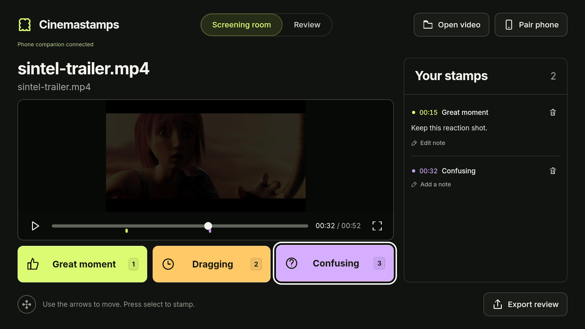

# Cinemastamps

A screening room for Fire TV. Watch your own rough cut, stamp **Great moment**, **Dragging**, or **Confusing** with the remote, revisit the exact playback moment, and export useful editing feedback.

Created by agammann.



**Development preview:** the browser and installed Android APK have been tested. Fire OS device verification and the qualifying Fire TV demo are still pending. The screenshot above is from a standard Android TV emulator.

## What works

- Real video playback, pause, seeking, and a theater view with stamp controls.
- Three timestamped reactions, editable notes, chronological review, and reaction filters.
- Saved review data across app restarts. CSV, Markdown, and JSON exports.
- A bundled Sintel trailer for an offline demonstration.
- Direct MP4/WebM links and local files in the browser.
- A local-network phone companion: scan a QR code, send a video, edit notes, and download the review.
- An Android APK with TV launcher support, directional navigation, media keys, and Back handling, intended for Fire OS.

## Run on a computer

Use Node.js 22.12+ and pnpm 11. Dependencies and versions are recorded in `pnpm-lock.yaml`.

If pnpm is not installed, run `npm install -g pnpm@11` once.

```sh
pnpm install --frozen-lockfile
pnpm build
pnpm start
```

Open <http://127.0.0.1:4318>. The app immediately offers the bundled film. Select Play and use the reaction buttons. Keyboard shortcuts: **1** great, **2** dragging, **3** confusing, **Space** play/pause. Arrow keys move focus; Enter selects. On the seek slider, Left/Right seek and Up/Down leave the slider.

For phone pairing, start the service on the local network instead:

```sh
pnpm start:lan
```

Select **Pair phone → Create phone link**, then scan the QR code from a phone on the same Wi-Fi. On a standalone TV, enter the computer's local address, for example `http://192.168.1.20:4318`. The computer must stay on while using the companion. The firewall must permit the chosen local port, and the Wi-Fi must allow devices to communicate. A VPN or multiple network adapters may require using the correct computer address manually.

Phone uploads support MP4 and WebM up to **250 MB**. H.264 video with AAC audio in MP4 is the recommended starting format for TV compatibility. Sending a new video starts a new review; export the current review first.

## Build and install on Fire OS

The Android project uses Java, Gradle 9.3.1, Android Gradle Plugin 9.1.1, compile SDK 37, target SDK 35, and minimum API 25. Use a compatible JDK and an updated WebView. This is an APK for Fire OS; it is not a Vega OS package.

```sh
pnpm build
pnpm android:sync
cd android
./gradlew assembleDebug
```

On Windows use `gradlew.bat`. Set `ANDROID_HOME` to the Android SDK and `JAVA_HOME` to a compatible JDK, or use Android Studio. Install Android SDK Platform 37 and Build Tools 36.0.0 if needed.

The APK is `android/app/build/outputs/apk/debug/app-debug.apk`.

```sh
adb connect FIRE_TV_IP:5555
adb install -r android/app/build/outputs/apk/debug/app-debug.apk
adb shell am start -n com.agammann.cinemastamps/.MainActivity
```

Enable developer options and ADB debugging on your own Fire TV and accept its connection prompt. Use a **Fire OS** model. Devices running Vega OS cannot install this APK.

Native exports are saved under the app's external Documents folder. Pairing a phone is the easiest way to download them. For development, retrieve native reports with:

```sh
adb pull /sdcard/Android/data/com.agammann.cinemastamps/files/Documents/reviews
```

## Data and boundaries

The standalone app stores the current review locally. Browser-local video files must be reselected after a page reload; selecting the same filename restores the saved review. Uploaded videos remain available through the companion service for the session lifetime. Disconnecting an uploaded video preserves notes and asks you to reopen the film.

The companion stores reviews and uploads in `data/` on the hosting computer. Pairing links grant access to that screening and expire after 24 hours; expired folders are pruned when a new screening is created. Disconnecting the TV does **not** revoke an existing phone link. This service is designed for a trusted local network and uses HTTP by default. Do not expose it directly to the public internet. There are no analytics, account registration, or external model calls. The bundled font and film work offline.

Playback timestamps are captured from the video element in seconds, including fractional seconds. They are suitable for review notes; this version does not promise frame-accurate editing timecode or direct editor integrations. CSV exports neutralize spreadsheet formulas and quote multiline notes.

## Verification

```sh
pnpm test
pnpm build
```

See [verification notes](docs/VERIFICATION.md) for the exact tested environments, completed workflows, and remaining hardware checks. A browser or standard Android TV emulator result is not proof of Fire TV hardware compatibility or a qualifying hackathon demo.

## Structure

- `src/`: React screening room, player, remote focus, dialogs, and phone companion.
- `shared/`: review model, timestamps, validation, and exports.
- `server/`: local companion API, authenticated sessions, and video uploads.
- `android/`: Fire OS Android wrapper and offline web assets after syncing.
- `tests/`: model and companion API tests.
- `docs/`: design, demo, and verification notes.

## Credits and license

Application source: MIT, copyright 2026 agammann. The bundled film, poster, and font have separate licenses documented in [THIRD_PARTY_NOTICES.md](THIRD_PARTY_NOTICES.md).
