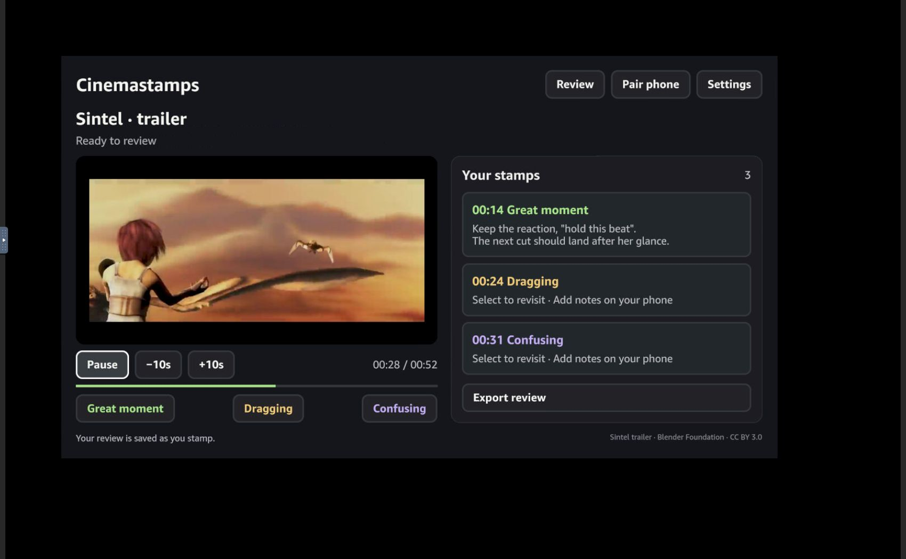
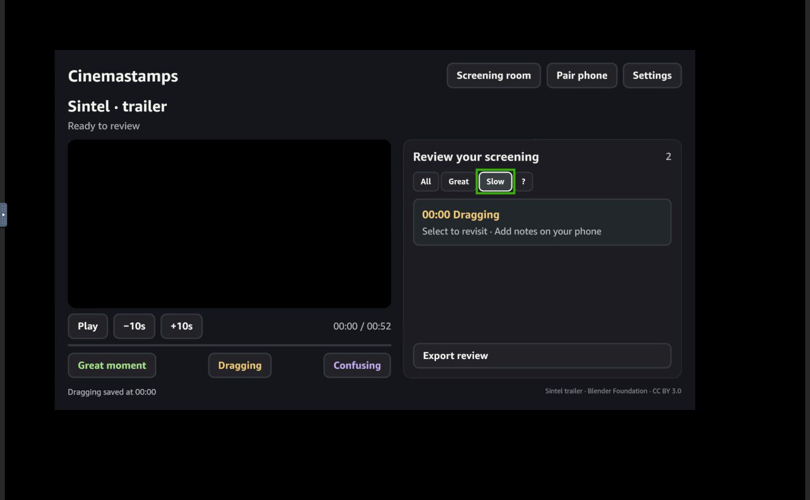

# Cinemastamps verification

## Version 0.2.2: remote controls and outage recovery — September 30, 2026

Follow-up testing used the same official Vega Virtual Device, OS 1.2 TV Ship/102401320, SDK 0.24.12112, and Docker-hosted companion described below.

Three reproducible application bugs were fixed:

- A single remote Play/Pause press was handled by both the app and the legacy player session, starting then immediately pausing playback. Media keys now go through Amazon's W3C/Kepler Media Controls integration once. Play after the end of a film explicitly rewinds and replays, matching the on-screen button.
- Starting the app while its companion was unavailable, then pressing Connect after service restoration, previously created an empty review. The app now keeps its saved pairing available for retry against the same companion address. It does not forward that pairing to a different address.
- A review filter remained active after returning to the screening screen, where its controls were hidden. Filtering now applies only in Review; returning to screening shows every saved reaction.

Verified results:

- One F4 press started playback, another paused it, F5 sought forward ten seconds, and F3 sought backward ten seconds. The media-control build completed the 52-second trailer after a full simulator restart. F4 then restarted the ended trailer and a further press paused it at 15 seconds.
- All three reaction types saved at actual playback positions. A companion note appeared on TV. A browser-downloaded CSV parsed as three rows with 14.830, 24.327, and 31.170 second timestamps; quotation marks and a line break in the note were retained.
- With three stamps and an edited note saved, the companion was stopped and the native app terminated/relaunched. The app displayed the network failure. Restarting the service and selecting Connect restored the same three stamps and note. The server review count remained eight before and after retry, confirming no replacement session was created. A subsequent full simulator restart retained the review.
- During the earlier outage check, the companion kept an unsaved note in its dialog after Save failed, re-enabled the button, and saved the retained draft successfully after service restoration.
- The Slow review filter showed only the dragging reaction, and selecting it moved playback to 24 seconds. After the final filter-only adjustment, the rebuilt package was reinstalled and verified to show the filtered reaction in Review and all three reactions after Back. The companion's 390 × 844 viewport had no horizontal overflow; its post-reload console contained no captured warnings or errors.
- The media-control build's 20-second simulator output capture measured -15.2 dBFS mean during playback. A four-second capture after remote pause contained digital silence (-91 dBFS, the measurement floor). noVNC itself still does not transmit live sound.
- Twelve model/API/media/playback-health/connection tests passed in the Docker image, zero skipped. Native TypeScript passed. ESLint had zero errors and eleven advisory/style warnings. Release builds completed for x86_64, aarch64, and armv7; only x86_64 was installed and exercised.

An intermediate 0.2.2 build encountered a startup playback stall and visibly recovered through the existing bounded player reload, then advanced normally. The final build's cold-start run did not stall. This is evidence of the recovery path operating on the simulator, not a fix for the unconfirmed underlying stall cause.

At the beginning of this follow-up, the browser showed an old app frame after the platform had terminated its process. Device logs attributed that termination to virtual-display disconnection. Relaunching recovered the saved review. Long unattended simulator operation and physical-device sleep/wake remain unverified. Simulator logs also contain recurring SDK "Application data root path is not set" diagnostics; saved-review persistence passed despite those messages. No clean platform-log claim is made.

Physical Fire TV, physical remote buttons, HDMI/speaker behavior, and a real phone remain untested. The focused VoiceView evidence below was collected with 0.2.1; it was not repeated for this update.

The final filter-adjusted package was rebuilt for all three architectures and reinstalled on x86_64. Its saved review survived the update, filtering returned correctly to the full screening list, and remote playback advanced to 28 seconds before being paused.

## Version 0.2.1: simulator audio and VoiceView — September 30, 2026

Follow-up testing used the same official Vega Virtual Device and a PulseAudio null sink inside its Ubuntu container. The sink's monitor recorded PCM generated by the emulator, not the source movie or the Windows microphone. noVNC still carries video and input only; it does not provide live audio in the browser.

- The original native build produced non-silent movie audio during playback (10-second capture: mean -15.7 dBFS), with silence before playback and after pause (4-second captures). These recordings establish that audio reaches the simulator's host output. They do not establish HDMI/speaker behavior or perceptual lip-sync on physical hardware.
- VoiceView was activated with Amazon's documented Back + Menu shortcut. Its configuration reported `ENABLED`; the tutorial and app navigation generated speech, and the green focus outline followed controls.
- Remote-only VoiceView interaction saved a reaction, opened review, selected the Slow filter, opened pairing, and returned to screening. Directional inputs in the pairing dialog did not activate background controls, and Select returned to screening.
- Recorded speech from the updated app includes "Rewind 10 seconds, button", "Forward 10 seconds, button", "Back to screening, button", and filter selected/not-selected announcements. An offline local transcription check corroborated those labels; it is supporting evidence, not a comprehensive accessibility audit.
- Updated accessibility semantics provide explicit seek/filter names, selected and disabled state, notes in stamp labels, a polite status region, and hidden background content while a dialog is open. Broader enhanced-navigation, long-note, and physical-device accessibility testing remains outside this pass.
- Native TypeScript passed; ESLint completed with zero errors and the same nine existing advisory/style warnings. All three release architectures built; x86_64 was installed as an update and retained the existing test review.
- A fresh Docker image passed all nine model/API/media/playback-health tests, zero skipped, with FFmpeg installed. Playback-health tests cover stalled progress, one report per stall, normal progress, pause/end, and backward seeking.
- The prepared launcher now restores KVM after a host restart, waits for full simulator boot, and clears only stale simulator/audio PID locks after their processes have stopped. Repeated launcher restarts completed successfully and retained the saved test review.

Cold-start testing also exposed a native media stall at about six seconds with silent output. Relaunching the player restored sound. The app now waits for `canplay`, monitors progress, and rebuilds a stalled player once while preserving the review and playback position. It offers **Settings → Reload player** for a manual retry. The eight-second stall threshold can trigger on a heavily overloaded simulator; recovery is bounded to avoid an endless restart loop. This is an application recovery measure, not a claim that the underlying simulator issue is fixed.

The final installed 0.2.1 package completed the 52-second trailer after a full simulator restart. A 35-second host-output recording measured -14.9 dBFS mean. The stall did not recur in this final run, so it did not exercise the automatic recovery callback on the device; the progress detector was tested separately. **Settings → Reload player** was exercised on the installed package: picture and time advanced again, the two saved stamps remained, and an eight-second output capture measured -16.7 dBFS mean. Pausing then produced a silent four-second capture.

The original 1:58 public demo remains an accurate demonstration of the workflow. This follow-up changes accessibility semantics and adds verification evidence; it does not replace that recording.

## Version 0.2.0: native Vega — September 30, 2026

The complete native app was installed and exercised on Amazon's Vega Virtual Device, OS 1.2 TV Ship/102401320, with SDK 0.24.12112 and CLI 1.4.2. The Linux host was Ubuntu 24.04 inside Docker Desktop on Windows, with KVM, Xvfb, Mesa software GL, and noVNC. This nested configuration worked locally; it is not claimed as an officially supported Amazon host configuration.

- Native TypeScript check passed (`npm test` is a typecheck, not a unit-test suite).
- Native ESLint completed with zero errors and nine warnings: system-library advisories and dynamic inline styles.
- Release packages built for x86_64, aarch64, and armv7. Only x86_64 was installed and exercised.
- A fresh Docker companion build passed all six Node model/API/media tests, zero skipped. The native media test generates a fixture and checks concurrent preparation, fMP4 output, H.264 level 3.1/AAC, duration, and remote-source rejection. API checks include authenticated pairing, source mismatch, and stale-stamp rejection.
- Actual film picture and advancing playback time were observed; play/pause, seeking, directional focus, all three stamps, review filtering, and timestamp selection followed by Play worked.
- A companion note appeared on the native TV. A CSV downloaded through the browser preserved 7.866, 15.462, and 24.111 second timestamps and the edited note.
- An MP4 uploaded through the companion played on Vega without restarting the app. The previous media player's asynchronous teardown is awaited before initializing the replacement.
- Terminate/relaunch preserved the paired review using Amazon's dedicated AsyncStorage library. Reinstalling with `vega run-app` resets application data and is not a persistence test.
- QR pairing showed the reachable local-network companion URL. Back closed the modal. A real physical phone was not used.
- The final x86_64 package was reinstalled and smoke-tested; playback completed and a remote-selected stamp saved. The prepared Windows launcher reopened the installed app successfully.

The 1:58 narrated demonstration contains actual captures of the installed native app, edited for length, with explanatory title cards and an actual exported review. The application footage is not a mockup. Audio and VoiceView were not validated in this initial pass; see the 0.2.1 follow-up above. Physical Fire TV performance, sleep/wake, and hardware remote media keys remain unverified. The native player buffers prepared short clips, bounded at 32 MB; it is not a long-form streaming implementation.

## Earlier browser and Android verification

Checked on September 29–30, 2026 (Pacific time).

Final regression pass: September 29, 2026 (Pacific time). The production build was rebuilt and the resulting APK was reinstalled before testing.

Repository reproducibility pass: September 30, 2026. A fresh public GitHub clone passed `pnpm install --frozen-lockfile`, all 4 model/API tests, `pnpm build`, `pnpm android:sync`, and Android `assembleDebug` using the documented SDK/JDK environment. GitHub recognizes the repository's MIT license. CI has not run: the connected GitHub credential did not permit publishing a workflow file. The checks listed here are local results.

## Earlier 0.1.0 result

The browser application and Android APK complete the intended screening workflow in the environments below. A physical Fire TV was not connected. This build is ready for Fire OS device testing; Fire OS compatibility and hackathon demo compliance are not yet verified on an Amazon device.

## Environments

- Windows, Node.js, production Vite build served at `http://127.0.0.1:4318`.
- Playwright Chromium at 1672 × 940 and 1280 × 720; companion at 390 × 844.
- Android TV API 36 x86_64 emulator, 1920 × 1080 physical display, 1280 × 720 CSS viewport, WebView 143.
- Browser/IAB was attempted first. Tab creation timed out, and the subsequent lookup found no tab. Playwright was used for browser validation.
- Native behavior was exercised with ADB remote key events and inspected through the app's debug WebView.

## Automated checks

`pnpm test`: 4 passing tests covering timestamps, export sorting and escaping, fractional timestamp retention, exclusion of credentials from reports, URL validation, session authorization, note persistence, duplicate-stamp handling, export, deletion, origin checks, and rejected non-video uploads.

Production web build and Android `assembleDebug` both pass. Android emits deprecated-API/Gradle notices; these do not prevent the build.

Final validation totals: 4 automated model/API tests, 19 browser workflow checks, 12 installed-APK checks, 5 phone-to-APK checks, and 5 reconnect/theater regression checks passed. A source credential-pattern scan found no matches; `pnpm audit --prod` reported no known vulnerabilities at the time of the check. These are bounded checks, not a claim that the app has no defects.

The final review fixed a session revision bug: re-pairing after disconnect now replaces the previous session's revision sequence, preserves the existing stamps, and displays newly added stamps immediately. Directional focus remains inside the visible theater controls. CSV escaping uses a browser-compatible regular-expression replacement.

## Browser interaction checks

| Workflow | Result |
|---|---|
| Correct page, meaningful content, no application runtime errors | Pass |
| Real film duration, playback, pause, seek | Pass |
| Button reactions and keyboard shortcuts | Pass |
| Notes edited and retained after reload | Pass |
| Stamp selection jumps to its recorded time | Pass |
| Review reaction filters | Pass |
| CSV download includes precise times and notes | Pass |
| Directional focus and 1280 × 720 viewport fit | Pass |
| QR link and phone companion | Pass |
| Phone note visible on screening screen | Pass |
| Phone upload replaces film and resets review | Pass |
| Uploaded film playback and reload persistence | Pass |
| Deletion synchronized between screens | Pass |
| 390px phone layout has no horizontal overflow | Pass |

## Installed Android APK checks

| Workflow | Result |
|---|---|
| Install and TV activity launch | Pass |
| Bundled video loads and plays offline | Pass |
| Remote media play/pause and forward seek | Pass |
| D-pad focus movement and center-button stamps | Pass |
| Notes and stamps survive WebView reload | Pass |
| Native JSON export creates a report file | Pass |
| Pairing to the computer's companion service | Pass |
| Phone-uploaded video plays in installed APK | Pass |
| TV stamps arrive on phone; phone notes arrive on TV | Pass |
| Back closes review/theater and exits root activity | Pass |

Two issues were caught and repaired during installed-app testing: partial reads of APK-packaged media failed in WebView, so the small bundled demo is loaded as a Blob; HTTP companion media was blocked from the HTTPS app origin, so the locally intercepted app origin uses HTTP, compatible with the explicitly local-network companion. Uploaded videos stream from the companion and are not loaded entirely into TV memory.

## Visual review

The concept and rendered screenshot were inspected at the concept's native 1672 × 940 size. The implemented layout, navigation labels, dark palette, reaction colors, typography hierarchy, panel geometry, and remote focus states were compared directly. The phone layout was checked separately.

| Comparison | Outcome |
|---|---|
| Brand and navigation copy | Preserved |
| Large stage with right-hand stamp rail | Preserved; responsive to actual viewport height |
| Charcoal background and three reaction colors | Preserved |
| Large headings and explicit control typography | Preserved; Inter bundled for consistent rendering |
| Rounded media frame and controls | Preserved |
| Empty-state wording | Preserved |
| Visible keyboard/remote focus | Added for the working app |
| Video asset and duration | Intentional change: licensed Sintel trailer and its actual 52-second duration replace the illustrative landscape and sample duration |
| Functional copy | Intentional additions: connection status, validation errors, file attribution, dialogs, and phone instructions |

No clipping or horizontal overflow was observed in the tested layouts. The implementation follows the selected design with the functional deviations above; it is not a pixel-identical rendering of the illustrative video still.

## Remaining physical-device and publishing checks

1. Install this APK on an actual Fire OS device and test its Amazon WebView, codecs, remote, sound, sleep/wake, and memory behavior.
2. Verify the phone flow on the actual TV/phone Wi-Fi network; emulator networking and a browser-sized phone view are not substitutes for that hardware check.
3. Test VoiceView and broader accessibility behavior on Fire TV.
4. Produce a signed release build and Appstore materials if publishing; this deliverable is a debug APK.
5. Completed September 30, 2026: the Vega demo is public on YouTube and the Devpost entry was submitted. The additional Android APK remains an earlier, separate deliverable.

Streaming-service video access, DRM, frame-accurate editing integrations, cloud accounts, and automated editing recommendations are outside this first version.
